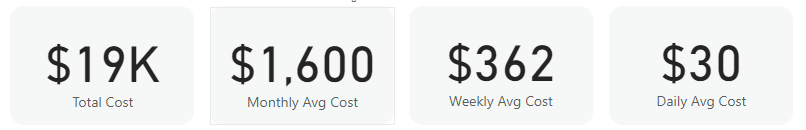

# Personal-Finance-Dashboard

## **Overview**
This **Power BI Personal Finance Dashboard** provides a **detailed analysis of personal spending habits** across multiple years. It helps track expenses, identify spending patterns, and make informed financial decisions.

The dashboard includes **interactive visualizations** for analyzing **monthly and yearly expenses, cost categories, expense ratios, and spending trends**.

# **Key Performance Indicators (KPIs)**
At the top of the dashboard, four key financial metrics provide a quick summary:
  - **Total Cost ($19K)**: The total amount spent across all categories.
  - **Monthly Average Cost ($1,600)**: The average monthly expenditure.
  - **Weekly Average Cost ($362)**: The weekly breakdown of spending.
  - **Daily Average Cost ($30)**: The average daily expense.
> [!IMPORTANT]
> **Insight**: These KPIs help assess personal budgeting and spending patterns over time.

# **Detailed Breakdown of Charts**

## **1. Yearly and Monthly Expense Table**
This table presents a **detailed breakdown of spending categories** for each year (2018, 2019, and 2020).
  - Categories include **Food, Clothing, Gym Membership, Coffee, Electronics, and more**.
  - **Food & Dining is the highest expense category ($13K in total).**
  - The yearly total cost **increases significantly over time**, reflecting spending habits.
> [!IMPORTANT]
> **Insight**: Identifying high-cost categories can help optimize spending and set budget limits.

## **2. Monthly Expense Trend (Line Chart)**
This visualization tracks **monthly spending patterns** across different years.
  - The trend shows **fluctuations in spending behavior**.
  - **Major spending spikes occur in April, July, and December**, indicating seasonal expenses.
> [!IMPORTANT]
> **Insight**: Understanding these trends can help in budget planning and forecasting future expenses.

## **3. Expense Ratio (Donut Chart)**
This chart compares expenses on **Weekdays (75%) vs. Weekends (25%)**.
  - **Higher spending on weekdays** suggests regular expenses like food, commuting, and utilities.
  - **Weekend spending is lower**, possibly indicating discretionary expenses.
> [!IMPORTANT]
>  **Insight**: This breakdown helps in **managing leisure vs. essential spending**.

## **4. Top 5 Locations by Cost (Donut Chart)**
This chart highlights where most of the spending occurs:
  - **Safeway (76%)** is the primary expense location, likely for groceries.
  - **Subway (18.77%)** indicates frequent spending on dining out.
  - Other locations like **Superstores (2.92%)** contribute to costs.
> [!IMPORTANT]
> **Insight**: Tracking spending locations can help **reduce unnecessary expenses** and optimize grocery purchases.

## **5. Category Wise Total Cost (Treemap Chart)**
This visualization categorizes spending into different segments:
  - **Food & Dining ($13K)** is the dominant category..
  - Other notable expenses include **Health & Wellness ($2K), Entertainment ($2K), and Miscellaneous ($2K)**.
> [!IMPORTANT]
> **Insight**: Managing **high-spending categories** can significantly **impact overall financial savings**.

# **Power BI Features Used in This Dashboard**
  ✅ **Interactive Filters**: Toggle between years, months, and rent-included or excluded expenses.

  ✅ **Drill-Through Analysis**: Analyze spending trends over time.

  ✅ **Dynamic Charts & Graphs**: Provides insights into different expense categories.

  ✅ **Data Model Optimization**: Ensures smooth performance for real-time analytics.

# **Conclusion**
This **Personal Finance Dashboard** provides an **in-depth view of personal expenses, spending habits, and cost distribution**. It is an excellent tool for **budget tracking and financial planning** using **Power BI**.

By analyzing these insights, users can make **smarter financial decisions, optimize expenses, and build better financial habits**.

